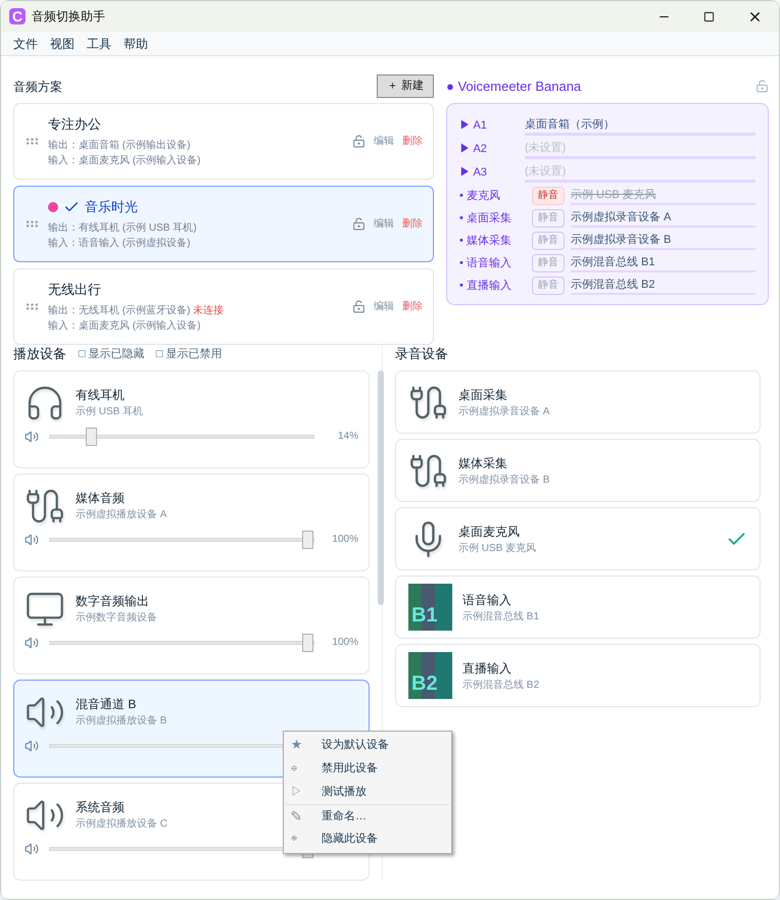
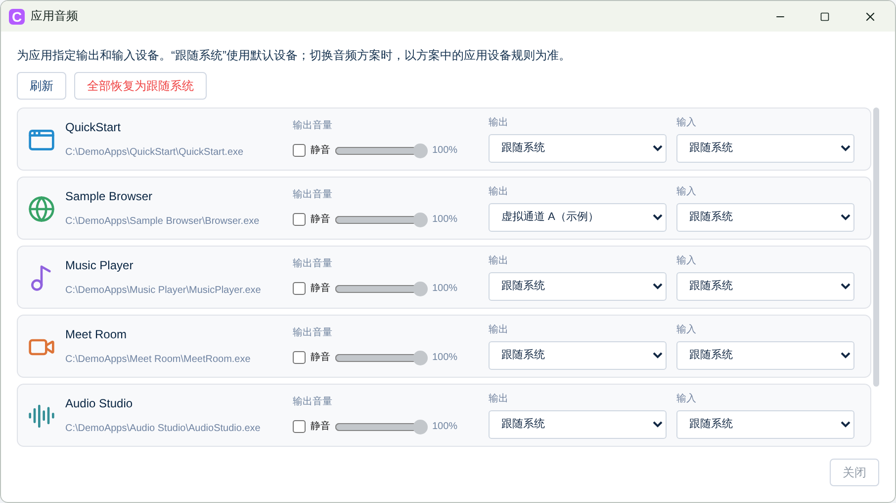
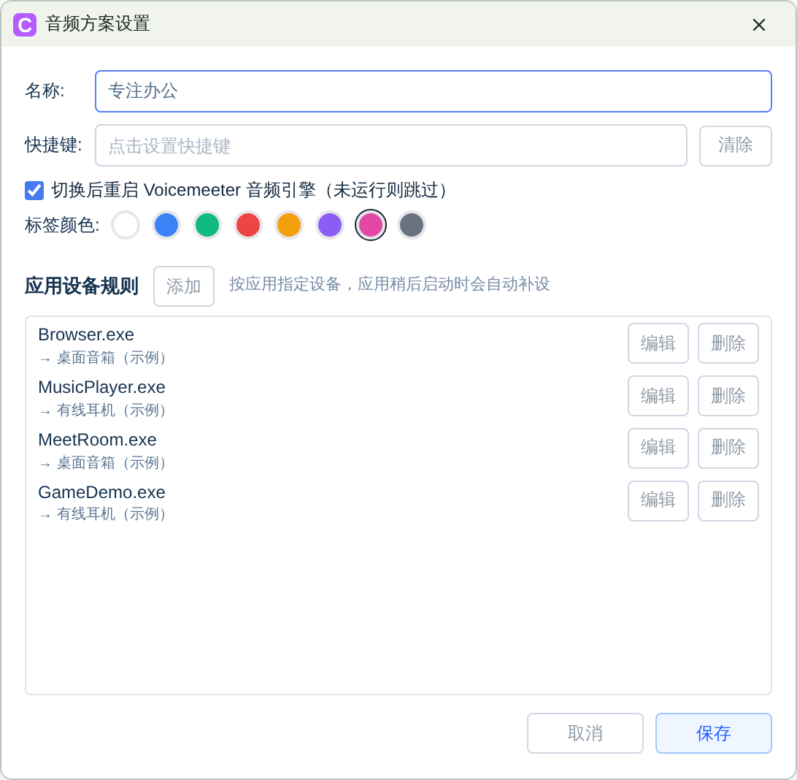
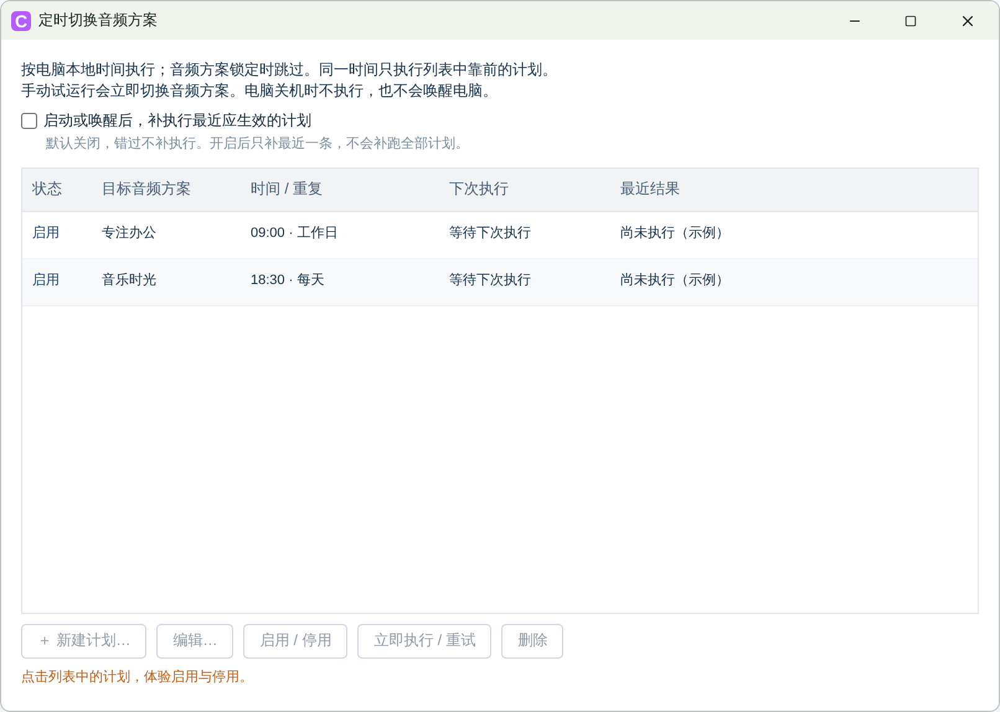

# 音频切换助手

Windows 音频设备切换工具。保存常用的输入、输出和应用设备规则，在工作、通话与娱乐之间快速切换。

[下载最新版本](https://github.com/secure-artifacts/AudioDeviceSwitcher/releases/latest) · [更新日志](CHANGELOG.md)

支持 Windows 10 version 2004（19041）及以上、x64；安装包自带运行环境。

## 功能

- **音频方案**：保存设备组合与应用规则，支持快捷键、排序和锁定。左键选择，右键切换。
- **应用音频**：单独设置应用输入、输出及输出音量；静音不影响麦克风输入，会话出现后自动应用设备规则。
- **定时切换**：支持每天、指定星期或单次计划，可启停、立即执行／重试。默认错过不补执行。
- **备份恢复**：备份方案、预设、设备别名和定时计划；同机导入前校验并确认覆盖范围。
- **设备与托盘**：设备音量、试听、别名、隐藏、开机自启，以及系统音量合成器快捷入口。
- **Voicemeeter 集成**：可选显示通道、电平、静音及设备状态。

## 截图

截图中的设备、应用与计划使用示例数据。

### 主窗口



### 应用音频



<details>
<summary>更多截图</summary>

### 音频方案编辑



### 定时切换



</details>

## 使用说明

1. 安装后新建音频方案，选择播放与录音设备。
2. 如需为应用指定设备，创建音频预设，再添加应用设备规则。
3. 右键方案进行切换；定时计划在「工具 → 定时切换音频方案」中设置。

切换方案会先重置所有应用的设备路由，再应用该方案的规则，未运行的应用也包含在内；不会重置音量与静音。多开实例目前按 EXE 路径共用规则，备份暂不支持跨电脑自动匹配设备。1.7.0 已暂时移除迷你窗口。

## 源码构建

需要 .NET 10 SDK；生成安装包还需 Inno Setup 6。

```powershell
dotnet build
dotnet run --project CKit
```

数据目录：`%AppData%\AudioDeviceSwitcher`。

## 许可

[MIT License](LICENSE)
